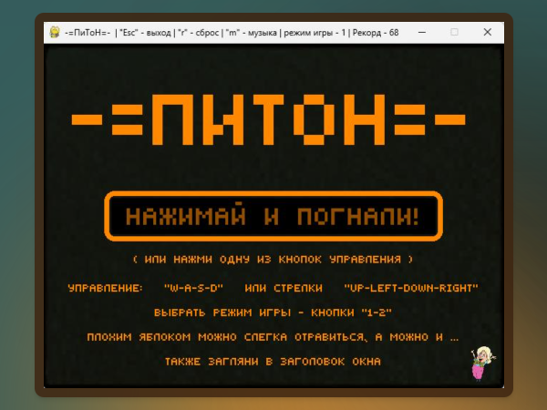

<a name="Start-point"></a>
# The snake

<p align="right" >
<i>Каждый разработчик хотя бы раз должен написать змейку!</i><br>Народная мудрость :)
</p>

**********
### [О проекте.](#about)
- #### [Описание проекта](#description)
- #### [Правила игры](#rules)
- #### [Технические подробности](#stack)
**********
### [Как запустить проект.](#How-to-run)
**********
### [Я просто хочу поиграть!!!](#Just-play)
**********


<a name="about"></a>
### О проекте

<a name="description"></a>
#### Описание проекта
Классическая компьютерная игра «Змейка» является одной из самых известных в мире игр. Простые правила, минималистичный дизайн и драйв — причины популярности этой игры на протяжении многих лет: прототип был придуман в 1976 году, а первая «Змейка», которую мы знаем, — в 1995-м.
Суть игры заключается в том, что игрок управляет змейкой, которая движется по игровому полю, разделённому на клетки.
Цель игры — увеличивать длину змейки, «съедая» появляющиеся на экране яблоки (часто изображаемые в виде точек или других символов).

 


***Авторы проекта:***

Гурин Валерий - (GitHub - [FuntikPiggy](https://github.com/FuntikPiggy))


<a name="rules"></a>
#### Правила игры
- Змейка состоит из сегментов.
- Змейка движется в одном из четырёх направлений — вверх, вниз, влево или вправо. Игрок управляет направлением движения, но змейка не может остановиться или двигаться назад.
- Каждый раз, когда змейка съедает яблоко, она увеличивается в длину на один сегмент.
- В классической версии игры столкновение змейки с границей игрового поля приводит к проигрышу. Однако в некоторых вариациях змейка может проходить сквозь одну стену и появляться с противоположной стороны поля. У вас будет именно так.
- Если змейка столкнётся сама с собой — игра начинается с начала.


<a name="stack"></a>
#### Технические подробности
Проект написан на языке программирования [Python](https://www.python.org/)
с помощью библиотеки [Pygame](https://pypi.org/project/pygame/).

<p align="right"><a href="#Start-point">Вернуться к началу</a></p>


<a name="How-to-run"></a>
### Как запустить проект:

Клонировать репозиторий и перейти в него в командной строке:

```bash
git clone git@github.com:FuntikPiggy/the_snake.git

cd the_snake
```

Cоздать и активировать виртуальное окружение:

```bash
python3 -m venv .venv
```

* Если у вас Linux/macOS

```bash
source .venv/bin/activate
```

* Если у вас windows

```bash
source .venv/Scripts/activate
```

```bash
python3 -m pip install --upgrade pip
```

Установить зависимости из файла requirements.txt:

```bash
pip install -r requirements.txt
```

<p align="right"><a href="#Start-point">Вернуться к началу</a></p>


<a name="Just-play"></a>
### Я просто хочу поиграть!!!:

Тогда тебе нужна только папка **"gamePython"** из этого репозитория.

В ней содержится единственный исполняемый файл, нужно просто его запустить.

В процессе игры в этой папке появятся ещё несколько файлов, в которых будут<br>
сохраняться твои достижения. Если эти файлы удалить, то игра не перестанет<br>
работать, лишь обнулятся твои достижения.

<p align="right"><a href="#Start-point">Вернуться к началу</a></p>
